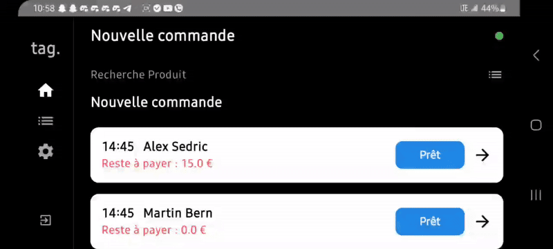

# 🧾 Android POS Prototype – Jetpack Compose & Kotlin

A **Point-of-Sale (POS) application prototype** developed using **Jetpack Compose** and **Kotlin**.  
This project simulates the interface and core functionalities of a modern POS terminal, optimized for a constrained screen size (58mm x 80mm).

---

## ⚠️ Important Note

> 🛠️ **This is a prototype version.**  
The **UI/UX is not finalized**, and the focus is on demonstrating **core functionality** tailored for a **specific form factor** (POS terminals).  
Some features are **mocked** or **simplified** for demonstration purposes.

---

## 📱 Target Device & Screen Orientation

- **Target Device Dimensions**: `58mm x 80mm`
- **Recommended Mode**: **Landscape (Rotated)**

> Using **landscape mode** is crucial to replicate the target POS terminal layout.  
On regular smartphones, **portrait mode compresses the interface**, making it less readable and unrepresentative of the real experience.

---

## 🎥 Demo

<p align="center">
  
</p>
<p align="center">
  
</p>

📽️ **Watch the full video demo**  
[👉 Click here to view on Google Drive](https://drive.google.com/drive/folders/1UQmcvJhLZocOe3ldT-Z1qPXcfTUX4Chp?usp=sharing)


---

## ⚙️ Technologies Used

- 🧠 **Kotlin**
- 🎨 **Jetpack Compose**
- 📦 **Android Architecture Components**
  - `ViewModel`
  - `StateFlow` / `LiveData`
- 🧰 **Gradle (KTS)**

---

## 🚀 Getting Started

### ✅ Prerequisites

- Android Studio (latest stable version)
- JDK 11+
- Android SDK API 21+

---

### 🔧 Installation Instructions

1. **Clone the Repository**

   ```bash
   git clone https://github.com/your-username/android-pos-prototype.git
   cd android-pos-prototype

   ## 👨‍💻 Author

- **Name**: MEDDAD Makhlouf 
- **LinkedIn**:[LinkedIn](https://www.linkedin.com/in/makhlouf-meddad-6674332a5/)  
- **Email**: makhloufmeddad@gmail.com
